# Entity Relationship Diagram

Self-Storage SaaS — unit-hq

---

## Multi-tenancy architecture

This platform uses a **database-per-tenant** model. Two distinct database scopes exist.

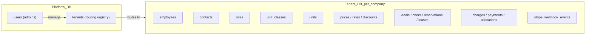

- **Platform DB** — one shared database for the platform. Holds admin users and a tenant routing table only.
- **Tenant DB** — one database per storage company. Holds all domain data. No `company_id` FK columns; isolation is enforced at the DB connection level.

---

## Design principles

| Rule | Implication |
|------|-------------|
| DB-per-tenant isolation | No `company_id` FK on tenant DB tables; scope enforced by connection routing |
| Three human models | `users` (platform admins), `employees` (company staff), `contacts` (prospective renters) |
| No Building model | Facility hierarchy is Site → Unit only |
| Money never as float | `NUMERIC(10,2)` on all monetary columns |
| Price immutability | `effective_from` / `effective_to`; rate changes = new `prices` row, never UPDATE in place |
| Unit availability derived | Not stored — computed from active leases + non-expired reservations |
| Ledger immutability | Append-only `charges` / `payments`; reversals via opposing rows with `reversal_of_*_id` |
| Invoice is a grouping view | `invoices` groups `charges`; not the atomic unit of money |
| Offer token security | `offers.token` is a crypto-random URL-safe string, not the PK |
| Single option selection | Partial unique index on `offer_options(offer_id) WHERE selected_at IS NOT NULL` |
| Pipeline order | Contact → Deal → Offer → OfferOption → Reservation → Lease |
| Stripe Connect | One connected account per tenant; Stripe info lives in Platform DB `tenants` table |

---

## High-level domain map (Tenant DB)

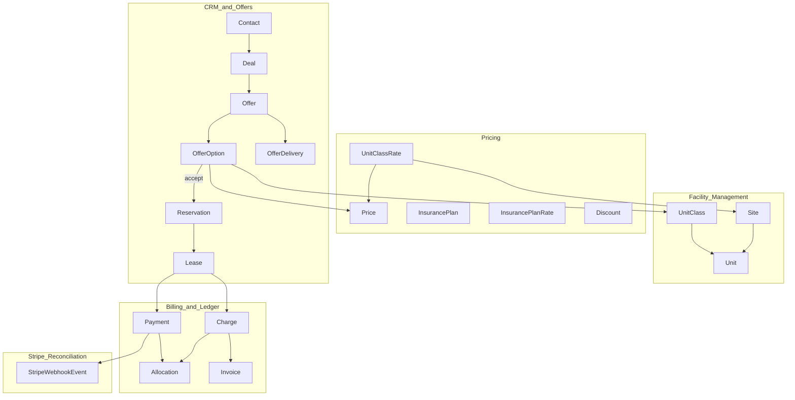

---

## Offer-accept transaction sequence

When a contact selects an offer option, the following three steps execute in a **single database transaction**. No partial state is ever visible.

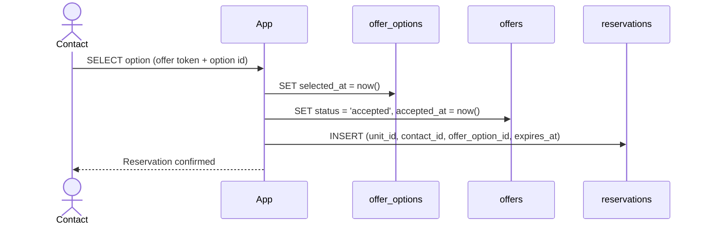

**Rules:**
- `offers` does **not** hold a back-reference to `reservations` — the FK is one-way: `reservations.offer_option_id → offer_options.id`
- The partial unique index on `offer_options(offer_id) WHERE selected_at IS NOT NULL` enforces that only one option per offer can ever be selected at the database level

---

## 1. Platform DB

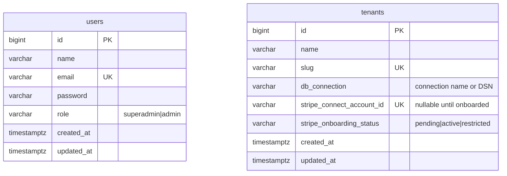

**Notes:**
- `users` are platform administrators only — they can create, edit, and delete tenants.
- `tenants` is the routing registry — the application reads `db_connection` to resolve which database to use for a request.
- Stripe Connect account info lives here because it is tenant-wide, not tied to any domain row inside the tenant DB.

**Indexes:** `tenants(slug)` UNIQUE, `tenants(stripe_connect_account_id)` UNIQUE

---

## 2. Tenant DB — People

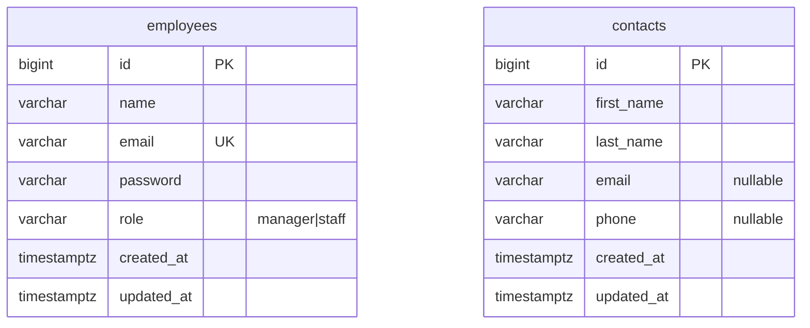

**Notes:**
- `employees` authenticate into the operator dashboard. `role` controls what they can do within the tenant.
- `contacts` are durable identity records for people who enquire or rent. Not all contacts will become tenants.
- No `company_id` — every row in the tenant DB is implicitly scoped to that company by the DB connection.

**Indexes:** `employees(email)` UNIQUE, `contacts(email)`

---

## 3. Tenant DB — Facility Management

Hierarchy: **Site → Unit** (no Building layer).

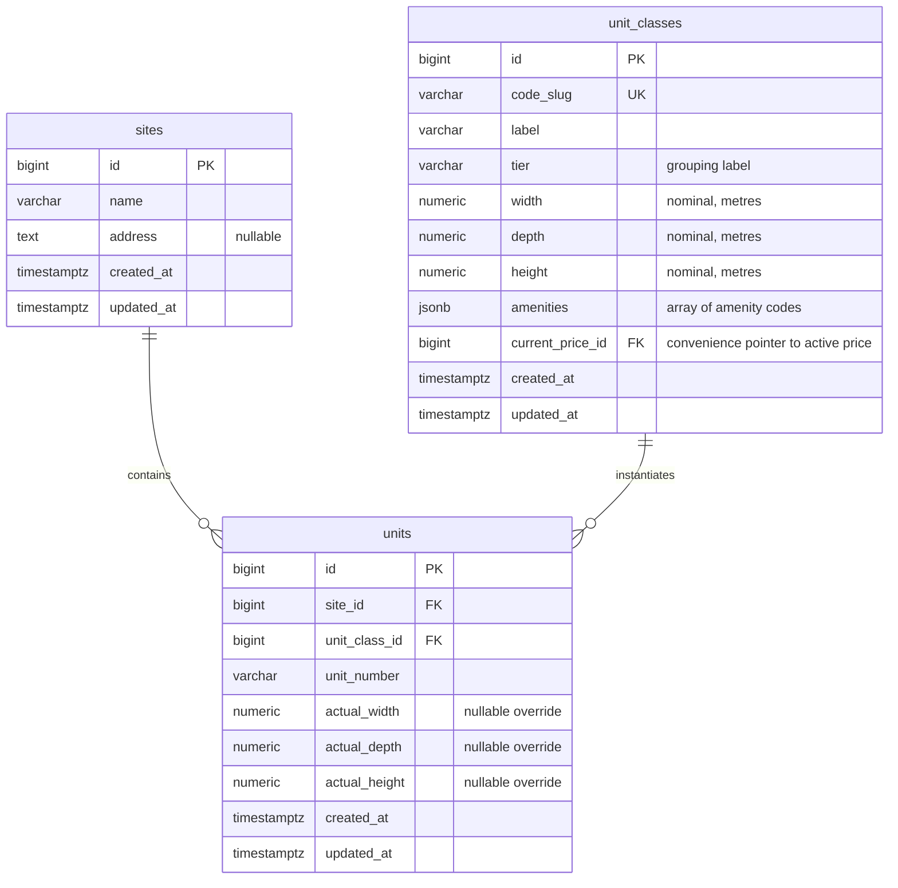

**Indexes:**
- `unit_classes(code_slug)` UNIQUE
- `units(site_id, unit_number)` UNIQUE
- `units(unit_class_id)`

**Derived (not columns):** `units.is_available` — computed by absence of active `leases` and non-expired `reservations` for that unit. Billing and listings use class dimensions; surveys and compliance use `actual_*` overrides when populated.

---

## 4. Tenant DB — Pricing

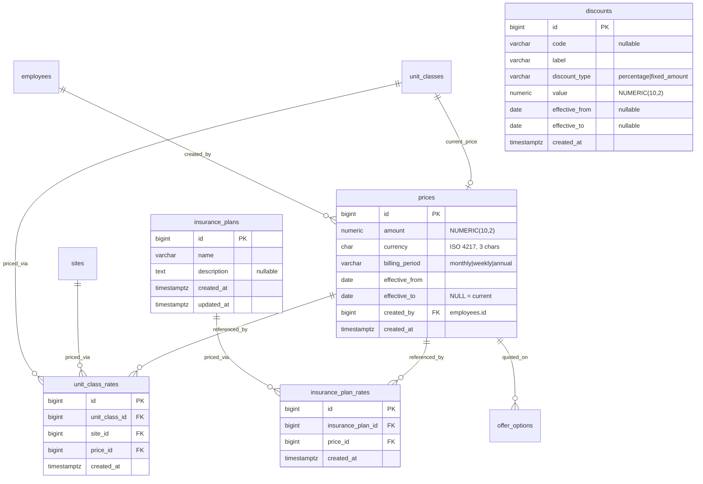

**Indexes:**
- `unit_class_rates(unit_class_id, site_id)` — active-rate resolution per site
- `unit_class_rates(unit_class_id, site_id, price_id)` UNIQUE
- `prices(effective_from, effective_to)` for temporal lookups

**Constraint notes:**
- Rate change = INSERT new `prices` row + INSERT new `unit_class_rates` row; SET `effective_to` on old `prices` row — never UPDATE amount in place.
- `unit_classes.current_price_id` is a convenience pointer; authoritative pricing history lives in `unit_class_rates` + `prices`.

---

## 5. Tenant DB — CRM, Offers, and Pipeline

Pipeline: **Contact → Deal → Offer → OfferOption → Reservation → Lease**

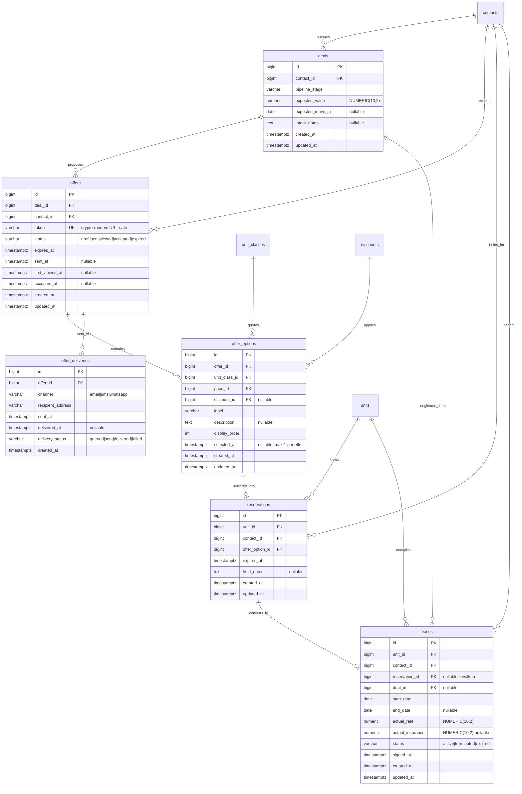

**Indexes and constraints:**
- `offers(token)` UNIQUE
- `offer_options(offer_id) WHERE selected_at IS NOT NULL` — partial UNIQUE (PostgreSQL); one selection per offer
- `offer_deliveries(offer_id, sent_at)`
- `reservations(unit_id)` + temporal filter for availability derivation
- `leases(unit_id, status)` for active-lease lookup

**Application event rules:**
- Offer `status` transitions: draft → sent → viewed → accepted; expiry checked at read time against `expires_at` — never flipped by a background job
- On option accept: single transaction writes `offer_options.selected_at`, sets `offers.status = accepted`, inserts `reservations`
- `offers` does not hold a back-reference to `reservations`

**Derived (not columns):** lease duration, size variance (actual unit dims vs class dims) — computed at query time.

---

## 6. Tenant DB — Billing and Ledger

Three layers: **ledger entries** → **invoice grouping** → **payment-to-charge allocation**.

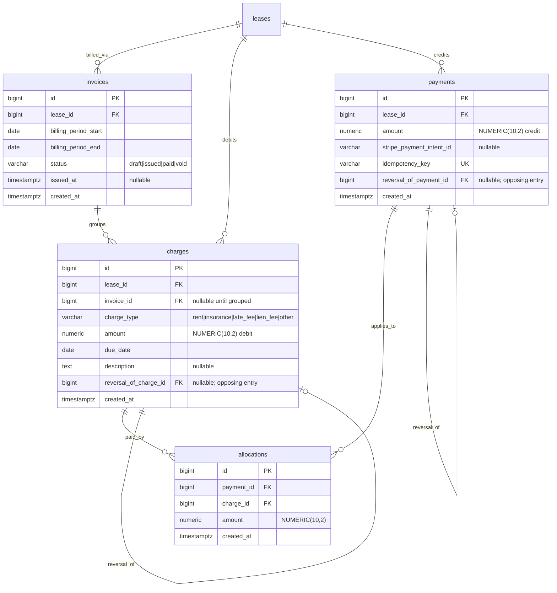

**Indexes:**
- `charges(lease_id, due_date)` — overdue calculation per charge
- `charges(invoice_id)`
- `allocations(payment_id)`, `allocations(charge_id)`
- `payments(idempotency_key)` UNIQUE

**Derived (not columns):**
- `balance_owed(lease)` = SUM(charges.amount) − SUM(payments.amount)
- `is_overdue(charge)` = charge.due_date < today AND SUM(allocations for charge) < charge.amount
- Overpayment = unallocated payment credit on lease — no row deletion, no flag stored

**Rules:**
- All rows append-only; reversals INSERT opposing entries with `reversal_of_*_id`
- Late-fee and lien eligibility driven by `charges.charge_type` + `charges.due_date` + configurable jurisdiction rules (future table)

---

## 7. Tenant DB — Stripe Reconciliation

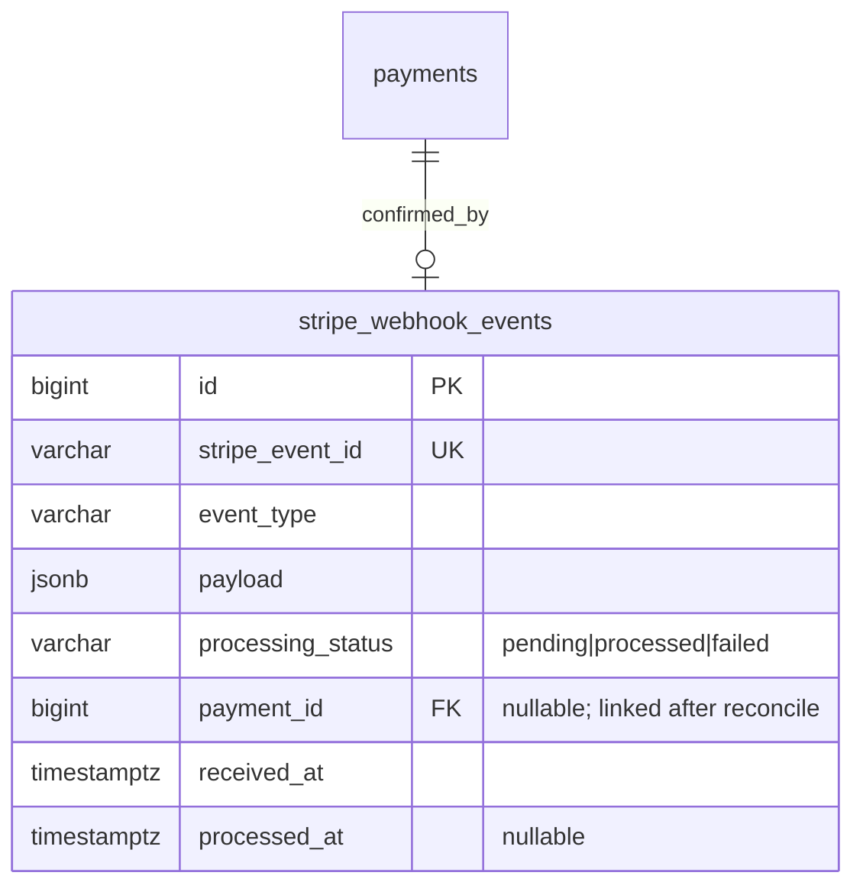

**Integration notes:**
- No `company_id` column — the row is already in the tenant's own DB.
- Webhook routing: platform receives event, reads `account` from Stripe payload, looks up `tenants(stripe_connect_account_id)`, routes to that tenant's DB.
- Payment confirmation from webhooks + `idempotency_key` — never optimistically from the client.
- Ledger is the system of record; Stripe events are inputs reconciled against it.
- Accounts v2; connected account is the merchant of record wherever possible.

---

## 8. Tenant DB — Dynamic Properties (Polymorphic)

Operator-defined custom fields for any entity. Currently attached to `units`; extensible to `contacts` or any other model with no schema change.

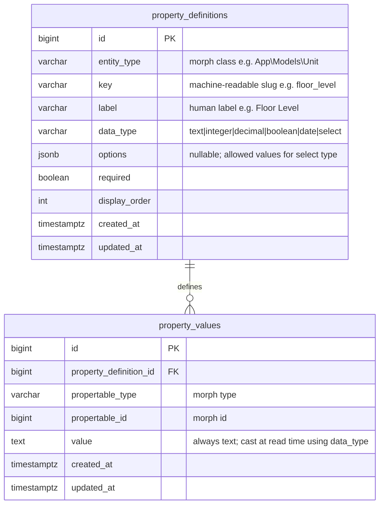

**Indexes:**
- `property_definitions(entity_type, key)` UNIQUE
- `property_values(propertable_type, propertable_id)`
- `property_values(property_definition_id, propertable_type, propertable_id)` UNIQUE

**Notes:**
- `value` always stored as text — cast to correct type at read time using `data_type`
- `options` as JSON on the definition row — select choices live with their definition
- Use `Relation::morphMap()` to shorten entity_type strings (e.g. `unit` instead of `App\Models\Unit`)

---

## 9. Tenant DB — Tasks

Polymorphic task system. Attachable to `Deal` and `Contact` today; extensible to any entity with no schema change.

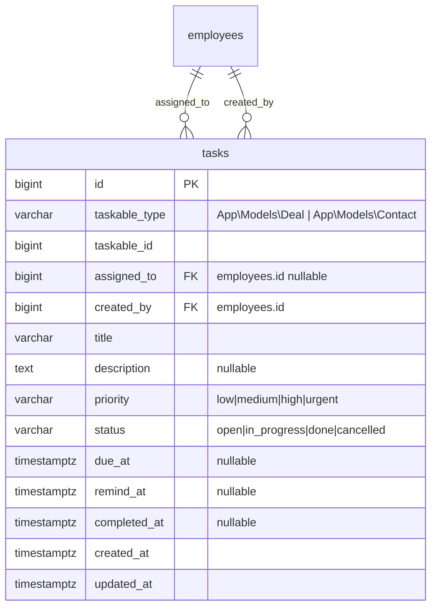

**Indexes:**
- `tasks(taskable_type, taskable_id)`
- `tasks(assigned_to, status)`
- `tasks(due_at, status)`
- `tasks(remind_at) WHERE remind_at IS NOT NULL AND status NOT IN ('done','cancelled')` — partial index for reminder scheduler (PostgreSQL)

---

## 10. Tenant DB — Comments

Append-only comment log. Attachable to `Contact`, `Deal`, `Task`, and `Reservation`.

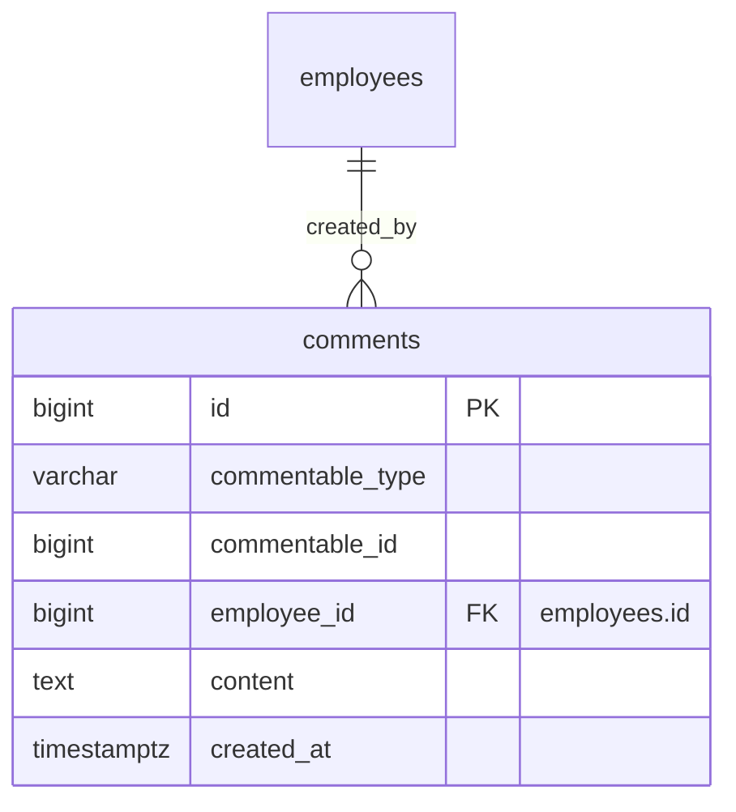

**Indexes:**
- `comments(commentable_type, commentable_id)`
- `comments(employee_id)`

**Notes:**
- No `updated_at` — comments are never edited; corrections are new comments
- Redaction extension path: add `is_redacted boolean` + `redacted_by bigint FK` without breaking existing queries

---

## 11. Relationship cardinality summary

| From | To | Cardinality | Notes |
|------|----|-------------|-------|
| Site | Unit | 1:N | Flat hierarchy — no Building |
| UnitClass | Unit | 1:N | Class = product definition; Unit = physical instance |
| UnitClass + Site | Price | N:M via UnitClassRate | Site-specific class pricing |
| Contact | Deal | 1:N | Identity vs pursuit |
| Deal | Offer | 1:N | Multiple proposals per deal |
| Offer | OfferOption | 1:N | Max 1 selected (partial unique index) |
| OfferOption | Reservation | 1:0..1 | Created on accept in same transaction |
| Reservation | Lease | 1:0..1 | Created at contract signing |
| Lease | Charge, Payment | 1:N | Ledger anchor |
| Payment | Charge | N:M via Allocation | Partial payments, cross-invoice |
| Charge | Invoice | N:1 | Grouped by billing period |

---

## 12. Open / TBD items

1. **Discount model** — `discount_type`, `value`, and effective-date rules need formalization before this table is used in production logic.
2. **Revenue model** — application fee vs SaaS subscription (or both) affects a future `platform_charges` table in the Platform DB.
3. **Jurisdiction rules** — configurable late-fee / lien thresholds need a future `jurisdiction_rules` table in the Tenant DB.
4. **InsurancePlanRate scoping** — whether rates vary by site is not yet explicit in the spec; current ERD shows plan-level junction only.
5. **Promotions** — separate from `Discount` per the original spec; stub only until further definition.
6. **Property validation** — server-side validation of `property_values.value` against `data_type` and `options` (application layer vs DB check constraint) is undecided.
7. **Task reminder delivery** — channel (in-app, email, push) not yet decided; `remind_at` column is channel-agnostic.
8. **Comment redaction** — no delete/edit in schema by design; GDPR/compliance redaction extension path is documented above.
