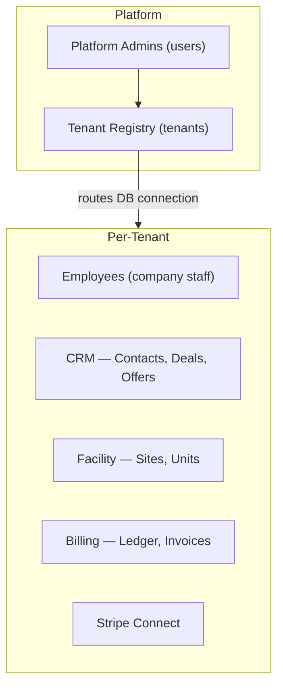

# Product Specification

unit-hq — Self-Storage SaaS Platform

---

## Product goal

A complete all-in-one digital platform for self-storage companies, built as multi-tenant B2B SaaS. The platform covers facility management, payments and billing, and a CRM for lead tracking. Operators should never need another application.

Each storage company (tenant) gets an isolated database. The platform is operated by platform administrators who provision and manage tenants.

---

## Architecture overview



---

## Module 1 — Facility management

### Data model

The facility hierarchy is: **Site → UnitClass → Unit**.

- **Site** — a physical storage facility location (formerly "center"). One company may have multiple sites.
- **UnitClass** — the commercial product definition. Holds a stable `code_slug`, human label, tier for grouping, nominal dimensions (width × depth × height in metres), amenities list, and a pointer to its current price. Type and size are not separate models because they are not independent dimensions.
- **Unit** — the physical instance. References its `UnitClass` and `Site`. May hold optional `actual_*` dimension overrides populated only when a unit physically differs from its class.

### Dimension rules

| Context | Dimensions used |
|---------|----------------|
| Billing and listings | UnitClass nominal dimensions |
| Surveys and compliance | Unit actual dimensions (when populated) |

### Unit availability

Unit availability is **always derived** from the absence of active leases and non-expired reservations. It is never stored as a flag on the unit — a stale flag would be a source of double-booking bugs.

---

## Module 2 — Pricing

### Immutability rule

Prices are never updated in place. A rate change means:

1. INSERT a new `prices` row with the new amount and `effective_from = today`
2. SET `effective_to = today` on the old `prices` row
3. INSERT a new `unit_class_rates` junction row pointing to the new price

This preserves the full pricing history and makes auditing straightforward.

### Price model

`Price` holds: amount as `NUMERIC(10,2)` (never float), currency (ISO 4217), billing period (monthly / weekly / annual), `effective_from`, `effective_to` (null = current), and `created_by` (employee).

### Rate variation by site

Prices vary by UnitClass and Site via the `UnitClassRate` junction table. A 5×5 unit can cost more at a city-centre site than at an out-of-town site.

### Insurance

`InsurancePlan` follows the same pricing pattern. Rates live in `InsurancePlanRate` → `Price`.

### Discounts

`Discount` expresses a reduction (percentage or fixed amount) rather than a standalone amount. Effective-date rules are to be formalized. Referenced from `OfferOption`.

---

## Module 3 — CRM and offer pipeline

### Pipeline stages

```
Contact → Deal → Offer → OfferOption (selected) → Reservation → Lease
```

Each stage has a distinct purpose:

| Stage | Record | What lives here |
|-------|--------|-----------------|
| Identity | Contact | Name, email, phone — the durable person record |
| Pursuit | Deal | Pipeline stage, intent notes |
| Proposal | Offer + OfferOption | Commercial options presented to the contact |
| Hold | Reservation | Inventory hold on a specific unit |
| Contract | Lease | Signed agreement, actual rate, billing anchor |

### Contact

The durable identity record. Holds personal details only. Not all contacts will rent. Contacts do not log in — they interact via shareable offer links.

### Deal

The pursuit record. Holds pipeline stage and intent notes. One contact can have multiple deals (e.g. enquiring for different locations).

### Offer

The commercial proposal stage. Sits between Deal and Reservation. Created by an operator employee for a contact who has not yet chosen a specific unit.

**Key rules:**
- `token` is a cryptographically random URL-safe string — the shareable link is built from this, not the PK, so it cannot be guessed by enumeration
- Status moves through: `draft → sent → viewed → accepted`
- Expiry is checked at read time against `expires_at` — status is never flipped by a background job during normal flow
- An offer can be resent via multiple channels (email, SMS, WhatsApp) via `OfferDelivery` rows without touching the offer record

### OfferOption

Each option inside an offer references a `UnitClass` (not a specific unit yet), a `Price`, and an optional `Discount`. The operator writes a label and description per option and controls display order.

When the contact selects an option, three things happen in a single database transaction:
1. `offer_options.selected_at` is written
2. `offers.status` is set to `accepted`
3. A `Reservation` row is inserted referencing `offer_option_id`

A partial unique index enforces that only one option per offer can ever be selected.

### Reservation

The inventory hold record. Always references a **specific unit** (not a class). Created at the moment of offer acceptance. Has an `expires_at` for hold expiry.

### Lease

Created at contract signing. References the unit, contact, reservation, and optionally the originating deal. Actual values (rate, insurance) live here. The billing ledger attaches to Lease — every charge, payment, and allocation references a Lease.

---

## Module 4 — Billing and ledger

The ledger is the source of truth for all financial state.

### Three-layer architecture

```
Layer 1 — Atomic entries:    charges (debits)   payments (credits)
Layer 2 — Grouping:          invoices (group charges by billing period)
Layer 3 — Mapping:           allocations (map payments to specific charges)
```

### Append-only rule

Charges and payments are never updated or deleted. Corrections are made by inserting an opposing row with `reversal_of_charge_id` or `reversal_of_payment_id` pointing to the original.

### Charge types

`rent`, `insurance`, `late_fee`, `lien_fee`, `other`

Charge type and `due_date` together drive automated late-fee assessment and lien eligibility. Jurisdiction-specific rules are configurable (planned as a separate `jurisdiction_rules` table).

### Invoices

An invoice groups charges for a billing period. It is **not** the atomic unit of money — it is a display grouping. The true paid/unpaid state is always derived from allocations.

### Allocations

An allocation row says: "X amount of payment P was applied to charge C." This enables:

- Partial payments — allocate only part of a charge
- Lump payments across invoices — one payment, allocations to charges from multiple invoices
- Overpayment — excess payment sits as unallocated credit on the lease

### Derived financial values

| Value | Formula |
|-------|---------|
| Balance owed | SUM(charges) − SUM(payments) |
| Is overdue | charge.due_date < today AND SUM(allocations for charge) < charge.amount |
| Unallocated credit | SUM(payments) − SUM(allocations) |

None of these are stored as columns — they are always computed at query time to prevent stale state.

---

## Module 5 — Payments and Stripe Connect

### Architecture

The platform uses **Stripe Connect** with one connected account per storage company. Stripe account info lives in the platform-level `tenants` table.

- **Existing operators** connect via OAuth
- **New operators** use Stripe-hosted onboarding
- Build on **Stripe Accounts v2**

### Merchant of record

The **connected account** (the storage company) is the merchant of record wherever possible. The platform never collects funds into its own account — doing so would make it the merchant of record and a money transmitter, requiring payment institution authorisation under PSD2 in Ireland.

Operators handle their own refunds and disputes directly.

### Webhook reconciliation

Stripe events are inputs reconciled against the ledger — the ledger remains the system of record.

```
Stripe webhook received
  → platform reads account from event
  → looks up tenants by stripe_connect_account_id
  → routes to that tenant's DB
  → inserts stripe_webhook_events row (status: pending)
  → reconciles against idempotency_key on payments table
  → if new: inserts payment + allocations
  → marks stripe_webhook_events row as processed
```

Payments are confirmed from webhooks, never optimistically from the client.

---

## Module 6 — Dynamic properties

Operators can define custom fields for entities (currently `units`, extensible to `contacts` and others). Two tables:

- `property_definitions` — defines the field: entity type, key, label, data type (text / integer / decimal / boolean / date / select), options for select fields, required flag, display order
- `property_values` — stores the value per entity instance as text, cast to the correct type at read time

This pattern avoids schema migrations when operators add new fields.

---

## Module 7 — Tasks

Polymorphic task system. Tasks are assignable to `Deal` and `Contact` today, extensible to any entity.

Each task carries: title, description, priority (low / medium / high / urgent), status (open / in_progress / done / cancelled), due date, reminder timestamp, completed timestamp, assignee (employee), and creator (employee).

The reminder scheduler queries `remind_at <= now()` on a scheduled job. Delivery channel (in-app, email, push) is not yet decided.

---

## Module 8 — Comments

Append-only comment log. Attachable to `Contact`, `Deal`, `Task`, and `Reservation`. Comments are never edited — corrections are new comments. Each comment records the authoring employee and a timestamp.

---

## People model

Three distinct human models with different scopes and purposes:

| Model | Database | Purpose | Authenticates |
|-------|----------|---------|---------------|
| `User` | Platform DB | Platform administrator — provisions and manages tenants | Yes — platform dashboard |
| `Employee` | Tenant DB | Company staff — operates the tenant dashboard | Yes — operator dashboard |
| `Contact` | Tenant DB | Prospective or current renter | No — interacts via shareable offer token |

---

## Open decisions

| Topic | Status |
|-------|--------|
| Revenue model | Not yet decided: application fees on rent vs flat SaaS subscription vs both. Interacts with Stripe charge type decision. |
| Discount formalisation | `discount_type` values and effective-date rules not yet decided. |
| Jurisdiction rules | Configurable late-fee and lien thresholds need a `jurisdiction_rules` table design. |
| InsurancePlanRate scoping | Whether rates vary by site is unspecified; current design is plan-level. |
| Promotions | Spec notes these are separate from discounts; model not yet defined. |
| Task reminder delivery | Channel (in-app, email, push) not yet decided. |
| Comment redaction | GDPR / compliance redaction path planned as `is_redacted` + `redacted_by` extension. |
